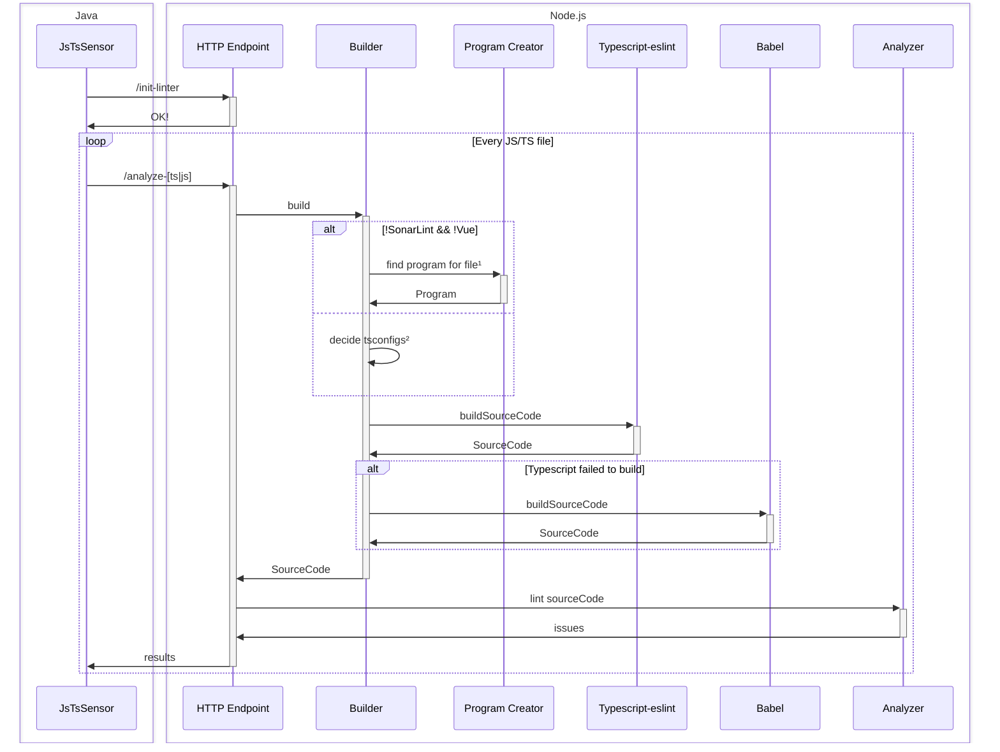
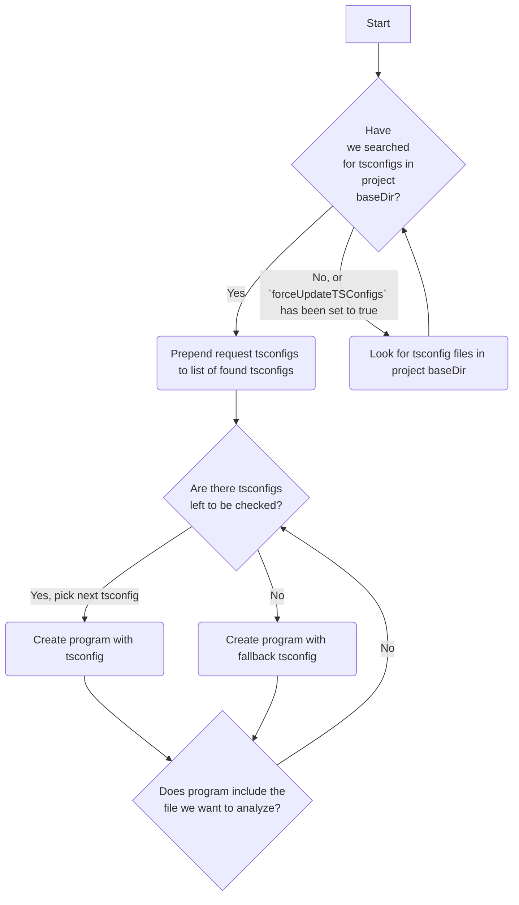
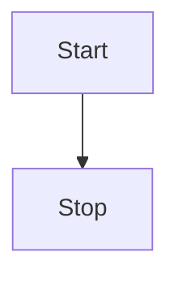

# SonarJS architecture

## Introduction

SonarJs consists on a Java side, which interfaces with the Sonar Scanner API, and a Node.js process, which will handle the analysis of the source files.

### Java plugin

- Initializes Node.js process
- Initializes the linters on the Node process (via `init-linter` endpoint)
- Loops though the files
  - Decides the type of analysis based on cache status
  - Requests analysis to Node.js
  - Retrieves results and saves them

### Node.js

- Handles the analysis of the files

## Sequence diagram

### Notes

1. Find program for file

2. Decide tsconfigs

